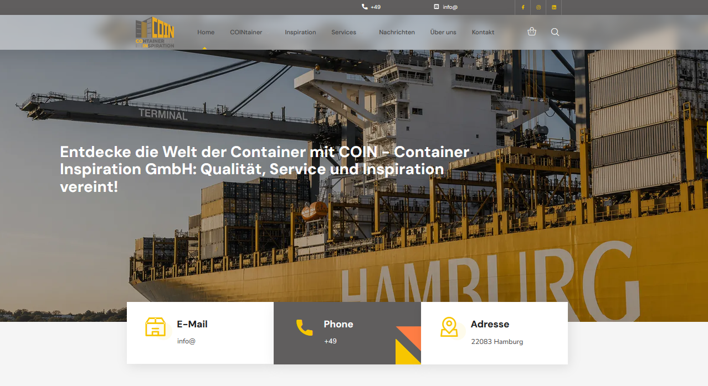

# ⚡ Container Theme

Custom WordPress/WooCommerce theme for a performance-first rebuild of the existing Elementor-based site.

Built on the [pra-theme] starter
(clean template hierarchy, deferred assets with filemtime cache busting, security
hardening out of the box, i18n-ready, PHPCS + CI + Playwright smoke tests).

> Design reference: the previous site uses the purchased Transmax theme. This theme
> reproduces the visual design only — no Transmax code or assets are used.


## 📸 Preview



## 🛠️ Performance budget

Benchmarked against the strongest competitor in the niche (Lighthouse mobile, homepage):

| Metric | Budget |
|---|---|
| Performance score | ≥ 99 |
| LCP | ≤ 1.9 s |
| Total transfer | ≤ 370 KB |
| Requests | ≤ 20 |

Every performance-affecting change is measured before/after (`npx lighthouse`,
mobile emulation) and the numbers go into the commit body.


## 🧩 Stack & conventions

- WordPress + WooCommerce, ACF Pro (content as ACF blocks in the block editor,
  one "Site Settings" options page with tabs), Contact Form 7, Yoast SEO.
- Content blocks are ACF blocks registered in `blocks/acf-blocks.php` under
  custom inserter categories (COIN Banners / Lists / Products / Text); each
  block template lives in `blocks/<category>/<name>.php`, its fields in
  `acf-json/`, and per-block assets are enqueued only where the block is used.
  Legacy flexible-content sections (`sections/`) remain on the Sections
  template landings until they are migrated to blocks.
- Vanilla JS only, everything deferred; fonts self-hosted; no CSS frameworks,
  no jQuery.
- All strings wrapped in gettext with the `containertheme` text domain
  (WPML-ready); site content is German, code and docs are English.
- ACF field groups sync to `acf-json/` and are committed together with the
  templates that use them.
- Admin-editable globals live on the Site Settings page and are read through a
  single cached helper — editable content must never add render-blocking or
  external requests.


## ✅ Quick Start Guide

### Step 1: Install Node.js

1. Go to [https://nodejs.org](https://nodejs.org)
2. Click the green **LTS** button to download
3. Run the downloaded `.msi` file

**Verify installation:**

```cmd
node --version
npm --version
```

### Step 2: Download Project

Download the project as ZIP from GitHub or get it from your client.

### Step 3: Open in VS Code
```cmd
npm install
```

### Step 4: Install Global CLI Tool

```cmd
npm install block_package
```

### Step 5: Build the theme

```cmd
npm run build
```

### Step 6: Install the Theme or Install via FTP (Alternative)

### Step 7: Activate the theme


## 📁 Theme Structure
container-theme/
├── acf-json/ # ACF field groups
├── assets/ # CSS, JS, images
│ ├── css/
│ ├── js/
│ ├── fonts/
│ └── images/
├── blocks/ # ACF blocks
│ ├── banners/
│ ├── lists/
│ ├── products/
│ └── text/
├── inc/ # Helper functions
├── languages
├── 404.php # 404 page
├── archive.php # Archives
├── comments.php
├── entry-content.php
├── entry-footer.php
├── entry-meta
├── entry-summary.php
├── entry.php
├── footer.php
├── front-page.php
├── functions.php # Core functionality
├── header.php
├── index.php # Main template
├── nav-below-single.php
├── nav-below.php
├── package.json
├── page.php
├── screenshot.png
├── README.md # Documentation
├── search.php # Search results
├── single.php # Single posts
├── style.css # Theme metadata
├── functions.php 
├── screenshot.png # Theme preview
├── template-landing-full.php
├── inc/ # Helper functionstemplate-landing.php
├── webpackage.config.js
└── woocommerce.php


## ⭐ Support

If you like this theme,  please give it a ⭐ on GitHub!

**Built with ❤️ by Jumbo00100**

## 📄 License

License: GPL v3 (inherits from BlankSlate via pra-theme).
